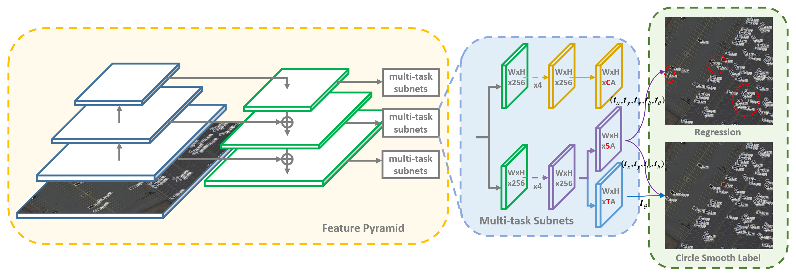
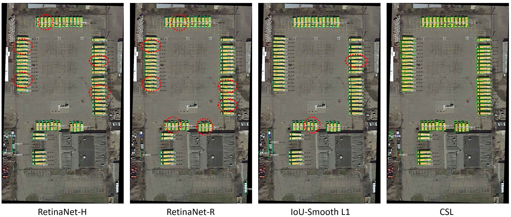
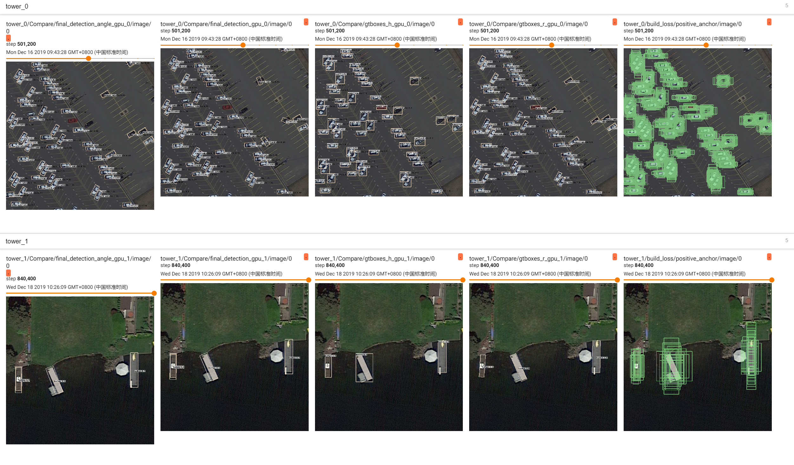
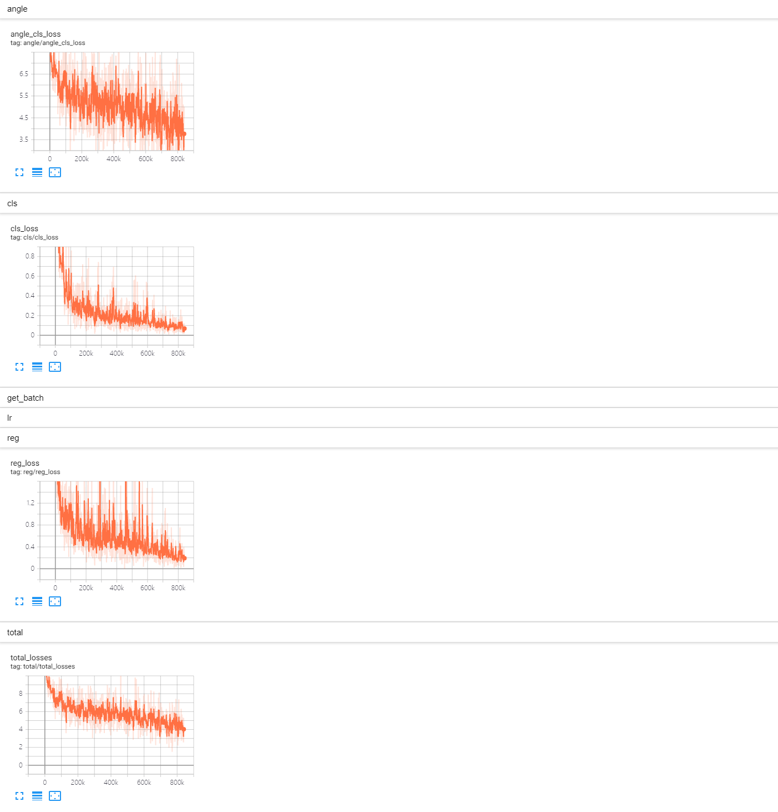

# Arbitrary-Oriented Object Detection with Circular Smooth Label

## Abstract
This repo is based on [Focal Loss for Dense Object Detection](https://arxiv.org/pdf/1708.02002.pdf), and it is completed by [YangXue](https://yangxue0827.github.io/).

Other CSL-based code: [R<sup>3</sup>Det-CSL](https://github.com/Thinklab-SJTU/R3Det_Tensorflow), [OHDet](https://github.com/SJTU-Thinklab-Det/OHDet_Tensorflow)

## Pipeline


## Circular Smooth Label


## Latest Performance
### DOTA1.0 (Task1)
| Model |    Backbone    |    Training data    |    Val data    |    mAP   | Model Link | Anchor | Label Mode | Reg. Loss| Angle Range | lr schd | Data Augmentation | GPU | Image/GPU | Configs |      
|:------------:|:------------:|:------------:|:---------:|:-----------:|:----------:|:-----------:|:-----------:|:-----------:|:---------:|:---------:|:---------:|:---------:|:---------:|:---------:|    
| [CSL](https://arxiv.org/abs/2003.05597) | ResNet50_v1 600->800 | DOTA1.0 trainval | DOTA1.0 test | 67.38 | [Baidu Drive (g3wt)](https://pan.baidu.com/s/1nrIs-oYA53qQzlPjqYkMJQ) | H | **Gaussian (r=1, w=10)** | smooth L1 | **180** | 2x | × | 3X GeForce RTX 2080 Ti | 1 | [cfgs_res50_dota_v45.py](./libs/configs/DOTA1.0/CSL/cfgs_res50_dota_v45.py) |
| [CSL](https://arxiv.org/abs/2003.05597) | ResNet50_v1 600->800 | DOTA1.0 trainval | DOTA1.0 test | 68.73 | [Baidu Drive (3a4t)](https://pan.baidu.com/s/1yC-b9Y4ZVgVkQvpPRRLmhw) | H | **Pulse (w=1)** | smooth L1 | **180** | 2x | × | 2X GeForce RTX 2080 Ti | 1 | [cfgs_res50_dota_v41.py](./libs/configs/DOTA1.0/CSL/cfgs_res50_dota_v41.py) |

**Notice:**     
**Due to the improvement of the code, the performance of this repo is gradually improving, so the experimental results in other configuration files are for reference only.**        
**Please refer to [new repo](https://github.com/Thinklab-SJTU/R3Det_Tensorflow) for the latest progress.**

### Visualization


## My Development Environment
**docker images: docker pull yangxue2docker/yx-tf-det:tensorflow1.13.1-cuda10-gpu-py3**      
1、python3.5 (anaconda recommend)               
2、cuda 10.0                     
3、[opencv(cv2)](https://pypi.org/project/opencv-python/)       
4、[tfplot 0.2.0](https://github.com/wookayin/tensorflow-plot) (optional)            
5、tensorflow 1.13                      

## Download Model
### Pretrain weights
1、Please download [resnet50_v1](http://download.tensorflow.org/models/resnet_v1_50_2016_08_28.tar.gz), [resnet101_v1](http://download.tensorflow.org/models/resnet_v1_101_2016_08_28.tar.gz) pre-trained models on Imagenet, put it to data/pretrained_weights.       
2、**(Recommend)** Or you can choose to use a better backbone, refer to [gluon2TF](https://github.com/yangJirui/gluon2TF).    
* [Baidu Drive](https://pan.baidu.com/s/1GpqKg0dOaaWmwshvv1qWGg), password: 5ht9.          
* [Google Drive](https://drive.google.com/drive/folders/1BM8ffn1WnsRRb5RcuAcyJAHX8NS2M1Gz?usp=sharing)      

## Compile
```  
cd $PATH_ROOT/libs/box_utils/cython_utils
python setup.py build_ext --inplace (or make)

cd $PATH_ROOT/libs/box_utils/
python setup.py build_ext --inplace
```

## Train

1、If you want to train your own data, please note:  
```     
(1) Modify parameters (such as CLASS_NUM, DATASET_NAME, VERSION, etc.) in $PATH_ROOT/libs/configs/cfgs.py
(2) Add category information in $PATH_ROOT/libs/label_name_dict/label_dict.py     
(3) Add data_name to $PATH_ROOT/data/io/read_tfrecord.py 
```     

2、Make tfrecord     
For DOTA dataset:      
```  
cd $PATH_ROOT\data\io\DOTA
python data_crop.py
```  

```  
cd $PATH_ROOT/data/io/  
python convert_data_to_tfrecord.py --VOC_dir='/PATH/TO/DOTA/' 
                                   --xml_dir='labeltxt'
                                   --image_dir='images'
                                   --save_name='train' 
                                   --img_format='.png' 
                                   --dataset='DOTA'
```      

3、Multi-gpu train
```  
cd $PATH_ROOT/tools
python multi_gpu_train.py
```

## Eval
```  
cd $PATH_ROOT/tools
python test_dota.py --test_dir='/PATH/TO/IMAGES/'  
                    --gpus=0,1,2,3,4,5,6,7  
                    --s (visualization, optional)
                    --ms (multi-scale test, optional)
``` 

## Tensorboard
```  
cd $PATH_ROOT/output/summary
tensorboard --logdir=.
``` 






## Object Heading Detection
- [OHD-SJTU]((https://yangxue0827.github.io/OHD-SJTU.html)): Download from [here](https://yangxue0827.github.io/OHD-SJTU.html).     
- [OHDet](https://github.com/SJTU-Thinklab-Det/OHDet_Tensorflow): The blue border in the bounding box represents the predicted head of the object. More detail trfer to [here](https://yangxue0827.github.io/CSL_GCL_OHDet.html).          


## Citation

If this is useful for your research, please consider cite.

```
@article{yang2020arbitrary,
    title={Arbitrary-Oriented Object Detection with Circular Smooth Label},
    author={Yang, Xue and Yan, Junchi},
    journal={European Conference on Computer Vision (ECCV)},
    year={2020}
    organization={Springer}
}

@article{yang2020on,
    title={On the Arbitrary-Oriented Object Detection: Classification based Approaches Revisited},
    author={Yang, Xue and Yan, Junchi and He, Tao},
    year={2020}
}

@inproceedings{xia2018dota,
    title={DOTA: A large-scale dataset for object detection in aerial images},
    author={Xia, Gui-Song and Bai, Xiang and Ding, Jian and Zhu, Zhen and Belongie, Serge and Luo, Jiebo and Datcu, Mihai and Pelillo, Marcello and Zhang, Liangpei},
    booktitle={Proceedings of the IEEE Conference on Computer Vision and Pattern Recognition (CVPR)},
    pages={3974--3983},
    year={2018}
}

```


## Reference
1、https://github.com/endernewton/tf-faster-rcnn   
2、https://github.com/zengarden/light_head_rcnn   
3、https://github.com/tensorflow/models/tree/master/research/object_detection    
4、https://github.com/fizyr/keras-retinanet     
